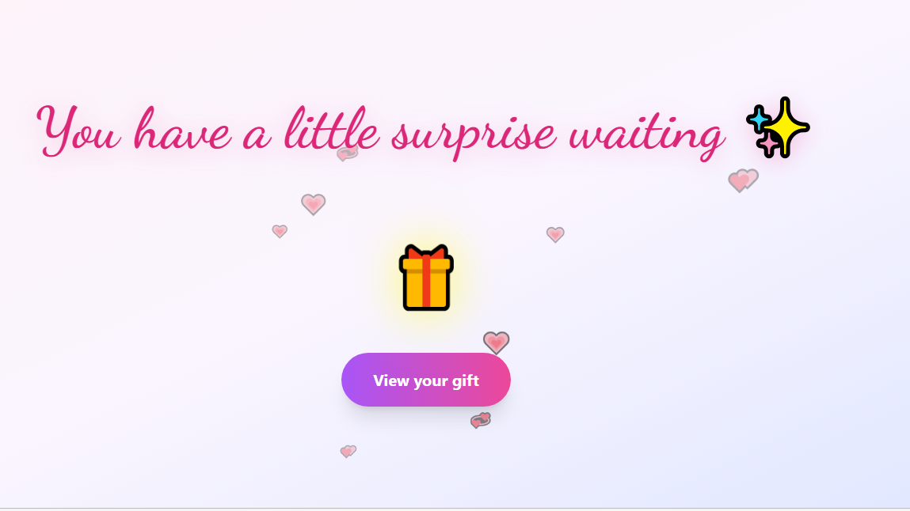
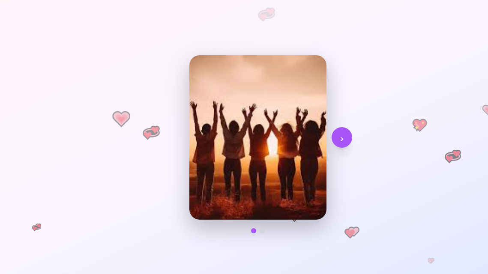
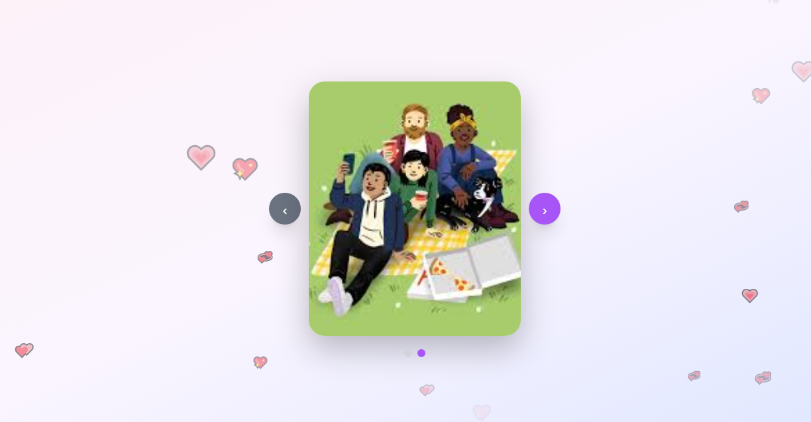
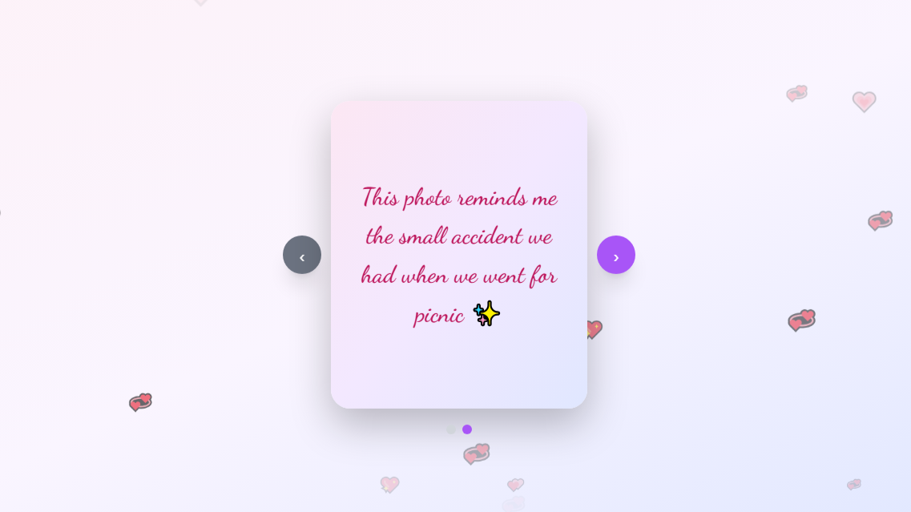
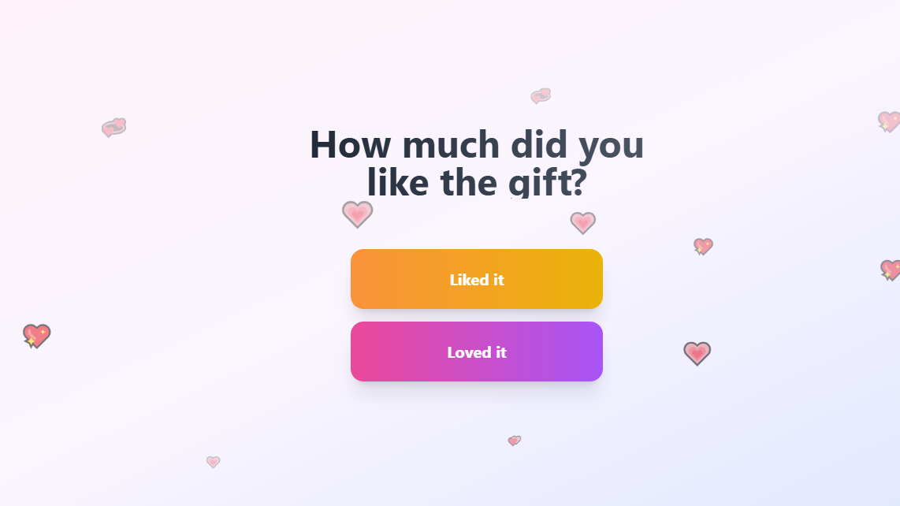
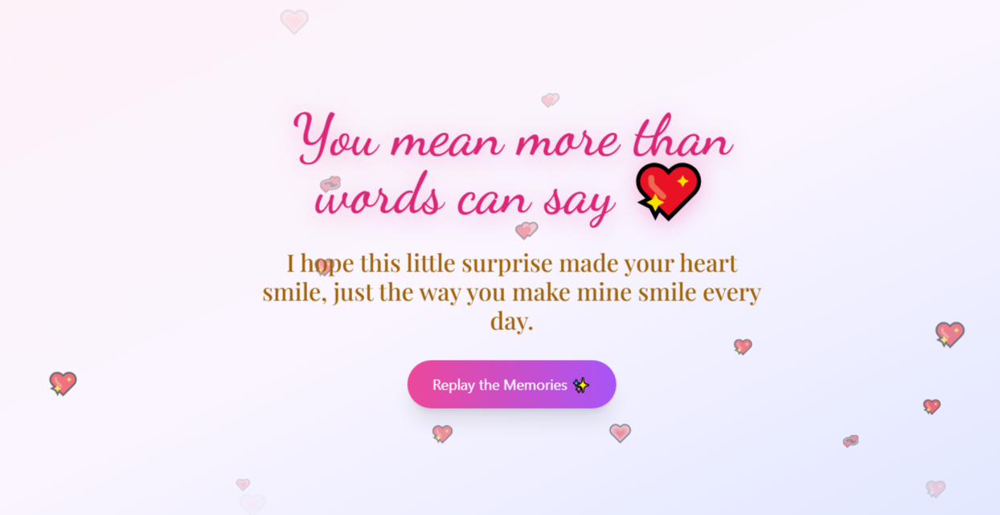

# 🎁 Interactive Gift Web App

An interactive and animated gift box experience built for fun and real-world use.
Click to open the gift, enjoy smooth animations, and explore a hidden gallery reveal.

This project focuses on UI creativity, animation handling, state management, and user interaction — built purely for enjoyment and experimentation.

---

## ✨ Features

- 🎀 Animated gift box with separate lid opening effect
- 💖 Floating heart background animation
- 🎉 “Open Your Gift” button to trigger reveal
- 🖼️ Gallery page reveal after opening the gift
- 🔁 Replay functionality
- 📱 Responsive design
- ⚡ Smooth transitions and clean UI

---

## 🚀 Tech Stack

- HTML
- CSS (Animations, Transitions, Effects)
- JavaScript (DOM Manipulation & Event Handling)

---

## 🎯 Purpose

This is **not an academic project**.
It was built for:

- Creative UI experimentation
- Practicing animation and interaction design
- Building something meaningful and fun
- Real-use sharing (surprise, birthday, special moments, etc.)

---

## 🛠️ How to Use

1. Clone the repository:

   ```bash
   git clone https://github.com/your-username/your-repo-name.git
   ```

2. Open the project folder.

3. Run `index.html` in your browser.

That’s it. 🎉

---

## 💡 Future Improvements (Optional Ideas)

- Add background music toggle
- Add confetti animation
- Add custom message input
- Add image upload option
- Deploy with custom domain

---

## 🌟 Project Demo









---

## 🤍 Made With

Built with creativity, emotion, and clean UI principles.

---
